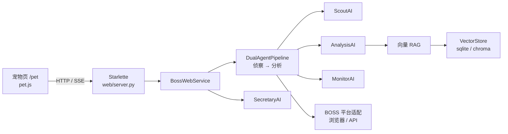

# 架构说明

本项目是本地运行的 **多 Agent 求职工作台**：浏览器打开宠物页，后端持有搜岗生命周期；刷新页面不会打断正在跑的任务。

## 总览



## 模块职责

| 模块 | 路径 | 做什么 |
|------|------|--------|
| Web | `pet_boss/web/` | 静态宠物页、REST、搜岗 SSE |
| 流水线 | `pet_boss/agents/pipeline.py` | 侦察→分析编排、翻页、风控退避、换词 |
| 侦察 | `pet_boss/agents/scout_ai.py` | 硬性筛选、拟人浏览节奏 |
| 分析 | `pet_boss/agents/analysis_ai.py` | 打分、通过分、RAG 参考 |
| 监控 | `pet_boss/agents/monitor_ai.py` | 浏览器健康、异常重启 |
| 秘书 | `pet_boss/agents/secretary_ai.py` | 简历、日报、邮箱 |
| RAG | `pet_boss/rag/` | Embedding、入库、相似度检索 |
| 可观测 | `pet_boss/observability/` | 结构化事件日志与汇总 |
| 决策日志 | `pet_boss/agents/decision_log.py` | Agent 策略/换词等决策落盘 |
| 评测 | `pet_boss/eval/` | 标注集与准确率报告 |
| 数据 | `~/.boss-agent/` | 登录态、画像、SQLite、观测日志 |

## 数据流（搜岗一轮）

1. 用户在宠物页点「开始搜岗」→ `POST` 启动管道  
2. **MonitorAI** 盯浏览器；**ScoutAI** 拉列表页、硬筛、去重  
3. 通过硬筛的岗位 → **AnalysisAI**（可先 RAG 召回历史案例）打分  
4. 通过分以上 → 右侧岗位栏 + 资料柜；未过 → 分析筛掉记录  
5. 列表扫完 → 按冷却策略换搜索词，进入下一轮  
6. 前端经 SSE / `scout/live` 同步页码、统计、「最新动作」

## Agent 决策点（可审计）

| 决策 | 触发 | 落盘 |
|------|------|------|
| 轮次策略 `scout_strategy_plan` | 每轮开始，LLM 或启发式 | `decisions.jsonl` |
| 换词 `scout_query_switch` | 列表耗尽 + 冷却 | 同上 |
| 分析通过/筛掉 | 分数 vs 通过分（可含 RAG） | 分析记录 + 向量库 |

固定编排（非自由 ReAct）：角色与边固定，决策在节点内发生并记日志，便于面试讲清「规划 / 记忆 / 工具」。

## 向量 RAG

- **默认**：SQLite 表 `rag_vectors`（`profile/profile.db`），余弦相似度  
- **可选**：Chroma 持久化目录 `rag/chroma/`（`ai_rag_vector_backend=chroma`）  
- Embedding：独立网关（如 SiliconFlow），与对话模型可分离  
- **检索**：低于 `ai_rag_min_score` 不注入；默认最多 `ai_rag_top_k`（5）条；低相似或过线条数不足时扩到 `ai_rag_expand_k`（8），仍过同一阈值  

```bash
# 可选依赖
pip install -e ".[rag]"
```

## 失败与恢复

- 浏览器断开 → `browser_session_lost` / 监控重启  
- 账号风控 → 退避后从第 1 页重开一轮  
- 页面隐藏 → 后端继续跑；回前台 `scout/live` 追进度  
- 登录态加密绑定机器标识；Docker 数据在卷 `boss-data`

## 可观测与评测

```bash
boss metrics          # 最近搜岗事件汇总（页码/跳过/通过/错误）
boss eval --capture --limit 20   # 抓取真实岗位 → data/eval/eval_today.json
boss eval                        # 默认用 eval_today.json 跑准确率
boss eval --labels <path>        # 指定其它标注集
boss doctor           # 环境自检
```

Web：宠物页办公室场景**下方**有「监控台」区块（下滚可见），展示观测汇总 / 评测 / **RAG 决策对比**；接口 `GET /api/boss/insights`、`POST /api/boss/eval`、`POST /api/boss/eval/capture`、`POST /api/boss/rag-ablation`。策略/换词决策仍写入 `decisions.jsonl`（不在页内列表展示）。

```bash
boss eval --rag-ablation --limit 5   # 有/无 RAG 对照打分（耗 Token）
```

「抓取评测集」：把当前通过岗位栏（不足 20 条时用分析库最近记录补齐）写成真实 BOSS payload 的 `data/eval/eval_today.json`；「跑评测」默认读取该文件。

观测日志：`~/.boss-agent/observability/scout_events.jsonl`  
决策日志：`~/.boss-agent/observability/decisions.jsonl`

## 与「玩具 Demo」的边界

本仓库侧重 **可运行的工程闭环**（状态、风控、持久化、可观测、评测），不是通用 Agent 中间件。扩展方向见评测报告与 `ai_rag_vector_backend` 可插拔设计。
